# SPRING_20221381 포트폴리오 (블로그 게시판 + 로그인 + 업로드/메일)

## 1. 프로젝트 소개

* Spring Boot 기반 게시판 프로젝트
* 회원가입 / 로그인 / 세션 기반 접근 제어
* 게시글 CRUD, 검색, 페이징 기능 구현
* (12주차) 파일 업로드 및 메일 전송 기능 구현

본 프로젝트는 주차별 실습 PDF 내용을 기반으로 기능을 단계적으로 확장하여
Spring Boot 웹 애플리케이션의 전체 흐름을 이해하고,
포트폴리오 형태의 결과물을 완성하는 것을 목표로 하였다.

---

## 2. 개발 환경

* Java 17
* Spring Boot 3.x
* DB: MySQL
* Build: Maven
* Template: Thymeleaf
* ORM: Spring Data JPA
* Security: Spring Security (세션 기반 인증)

---

## 3. 실행 방법

1. DB 생성 및 설정 (`application.properties`)
2. 프로젝트 빌드

```
mvn clean package
```

3. 서버 실행

```
mvn spring-boot:run
```

4. 접속

```
http://localhost:8080
```

---

## 4. 주차별 학습 내용 & 구현 기능

### 2주차: 개발환경 설정 및 테스트

* Spring Boot 프로젝트 생성
* Maven 기반 프로젝트 구조 이해
* 기본 Controller와 HTML 연동 테스트

### 3주차: 포트폴리오 프론트 구성

* Thymeleaf 기반 HTML 화면 구성
* 게시판 화면 레이아웃 설계
* 정적 리소스(CSS, JS) 적용

### 4주차: 데이터베이스 연동 및 테스트

* MySQL 연동 설정
* JPA Entity 및 Repository 구성
* 게시글 데이터 DB 저장 및 조회

### 5주차: 게시판 1

* 게시글 목록 / 상세 / 작성 기본 흐름 구현
* Controller → Service → Repository 구조 이해

### 6주차: 게시판 2 (수정/삭제)

* 게시글 수정 화면 및 수정 처리
* 게시글 삭제 기능 구현
* PUT / DELETE 요청 방식 이해

### 7주차: 추가 수정

* 예외 처리 (존재하지 않는 게시글 접근)
* 화면 개선 및 코드 정리

### 9주차: 검색 / 페이징

* 키워드 검색 기능 구현
* PageRequest 기반 페이징 처리
* 페이지 이동 UI 구성

### 10~11주차: 로그인 / 로그아웃

* 회원가입 기능 구현
* 로그인 검증 로직 구현
* HttpSession을 이용한 로그인 상태 유지
* 로그인 사용자만 게시판 접근 가능하도록 제한
* 로그아웃 시 세션 무효화 처리

### 12주차: 포트폴리오 완성

* 파일 업로드 기능 구현
* 메일 전송 기능 테스트
* 전체 프로젝트 소스 코드 정리
* GitHub Pages용 정적 페이지 구조 구성

---

## 5. 주요 기능

* 회원가입 / 로그인 / 로그아웃
* 세션 기반 사용자 인증
* 게시글 작성, 조회, 수정, 삭제
* 게시글 검색 및 페이징
* 파일 업로드 기능
* 메일 전송 기능

---

## 6. 주요 화면 스크린샷

* 회원가입 화면
* 로그인 화면
* 게시판 목록 및 페이징 화면
* 게시글 작성 및 상세보기 화면
* 게시글 수정 / 삭제 화면
* 파일 업로드 결과 화면

---

## 7. 폴더 구조

* src/main/java/com/example/demo

  * controller : 요청 처리
  * service : 비즈니스 로직
  * repository : DB 접근
  * domain : Entity 클래스
  * config : 보안 및 설정 파일
* src/main/resources/templates
* src/main/resources/static
* src/main/resources/application.properties

---

## 8. 주의사항

* 추가 문제(2명 이상 로그인 제한, 동일 파일명 업로드 변경)는 미구현

---

## 📸 실행 결과 스크린샷

> 아래 스크린샷은 프로젝트의 주요 기능이 정상적으로 동작함을 보여준다.

### 1. 메인 화면

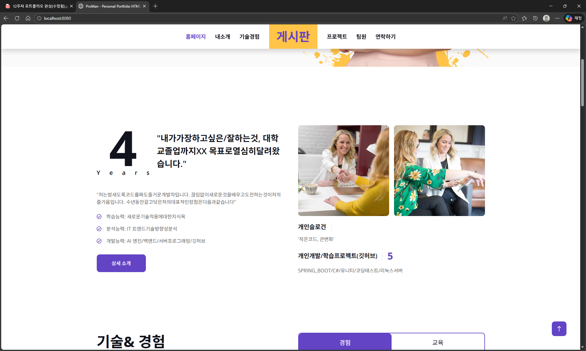

### 2. 회원가입 화면

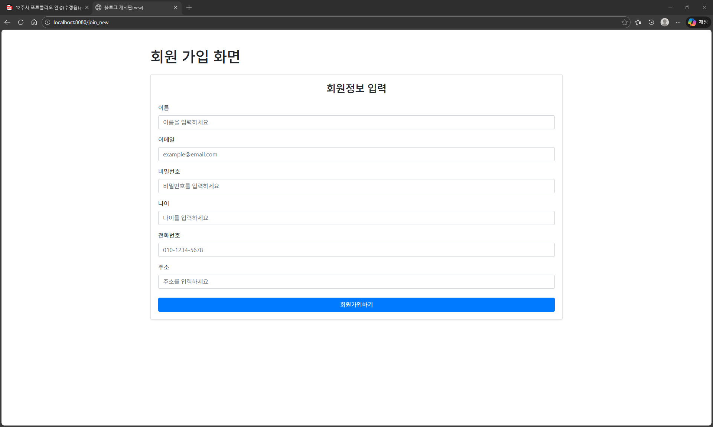
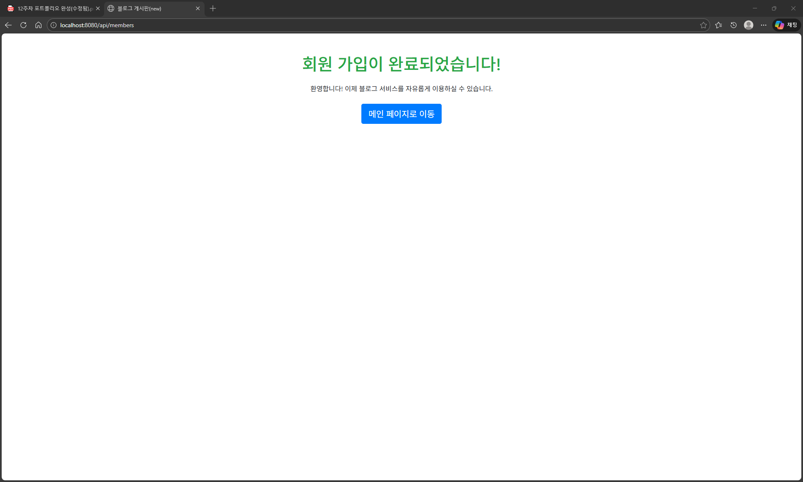

### 3. 로그인 화면

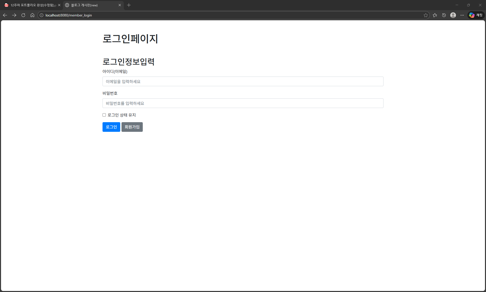

### 4. 로그인 후 게시판 목록

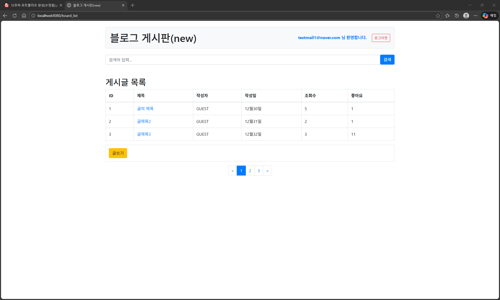

### 5. 게시글 작성 화면

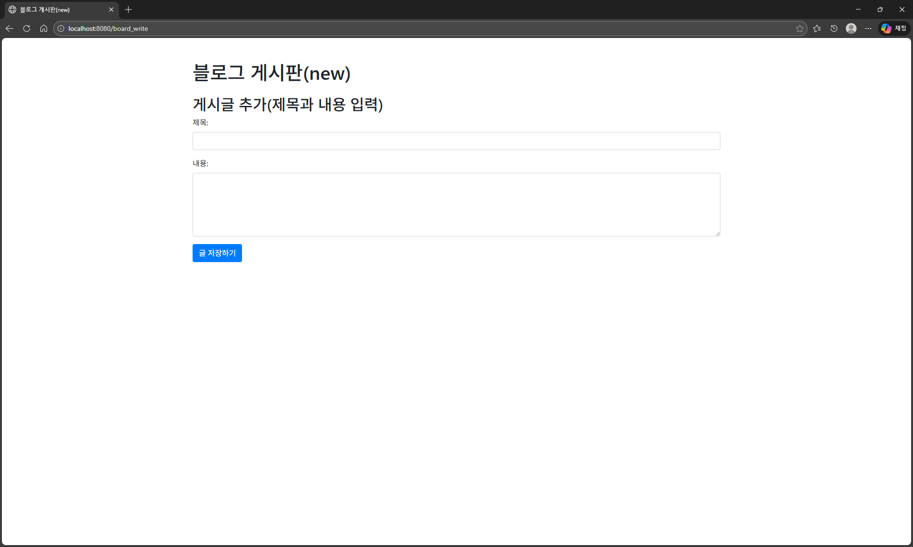

### 6. 게시글 상세 보기 (작성자만 수정/삭제 버튼 표시)

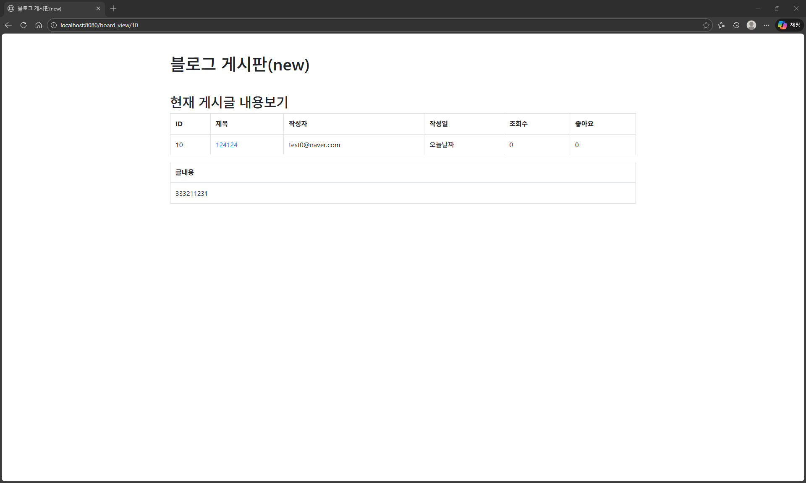
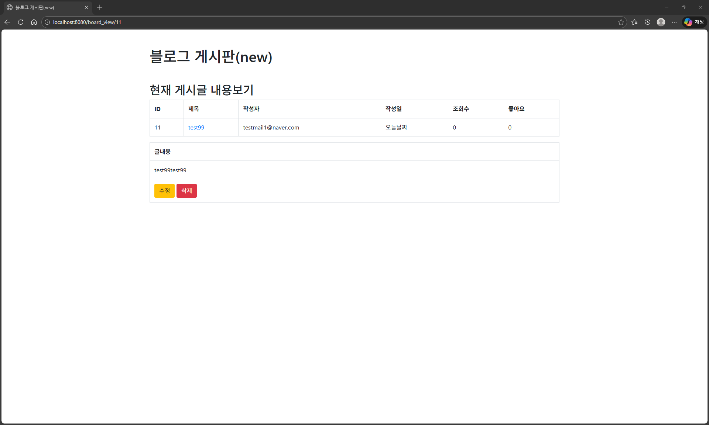


### 7. 게시글 수정 화면

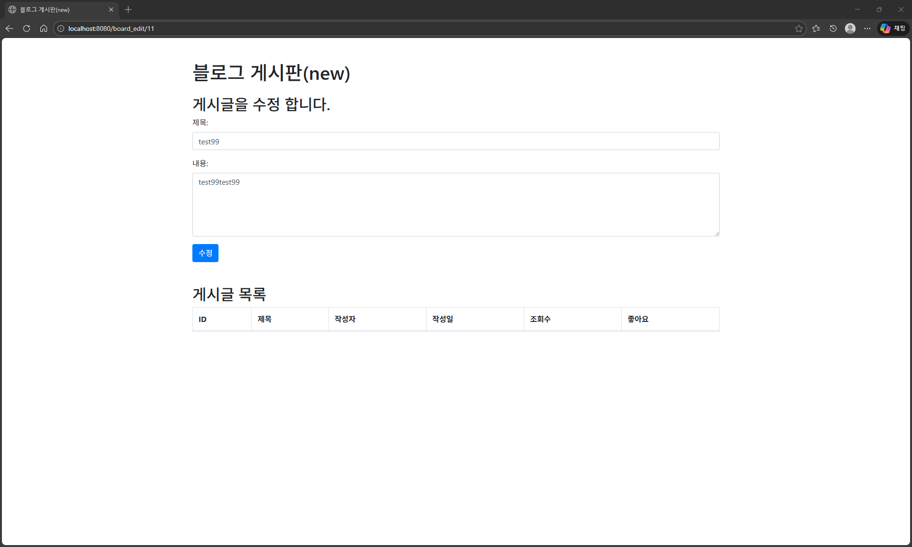
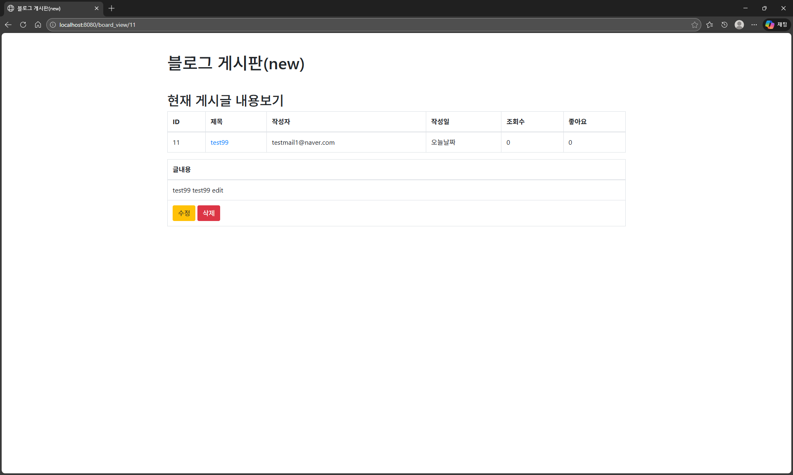
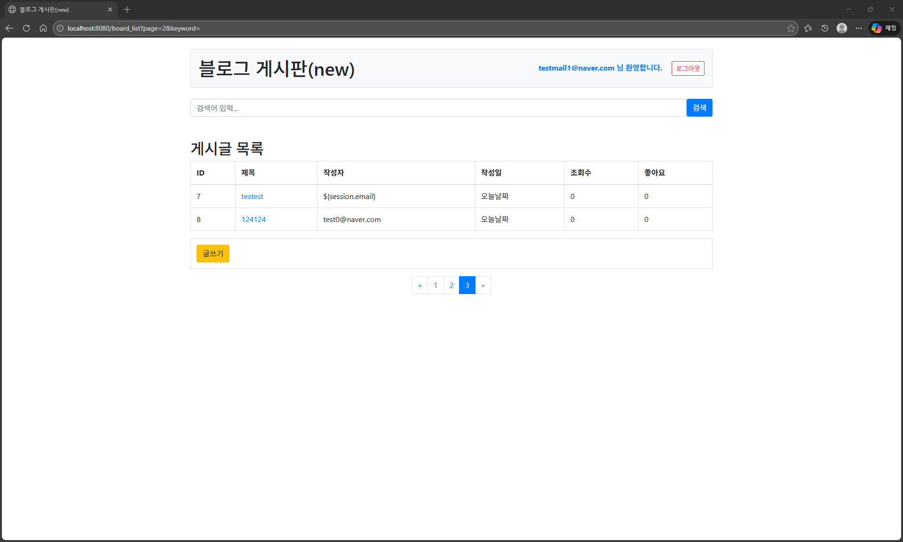

### 8. 파일 업로드 성공 화면

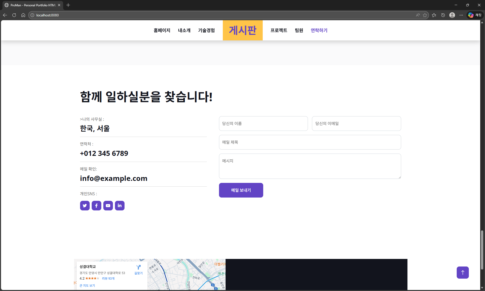
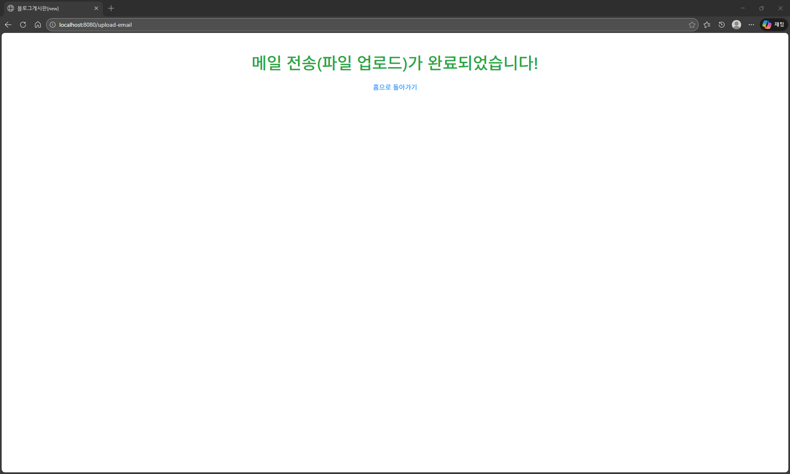
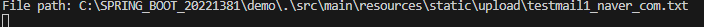
